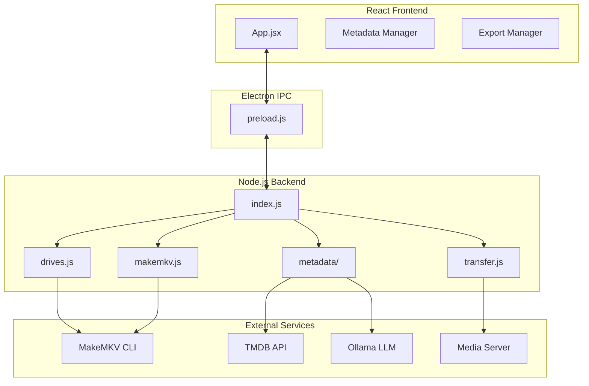
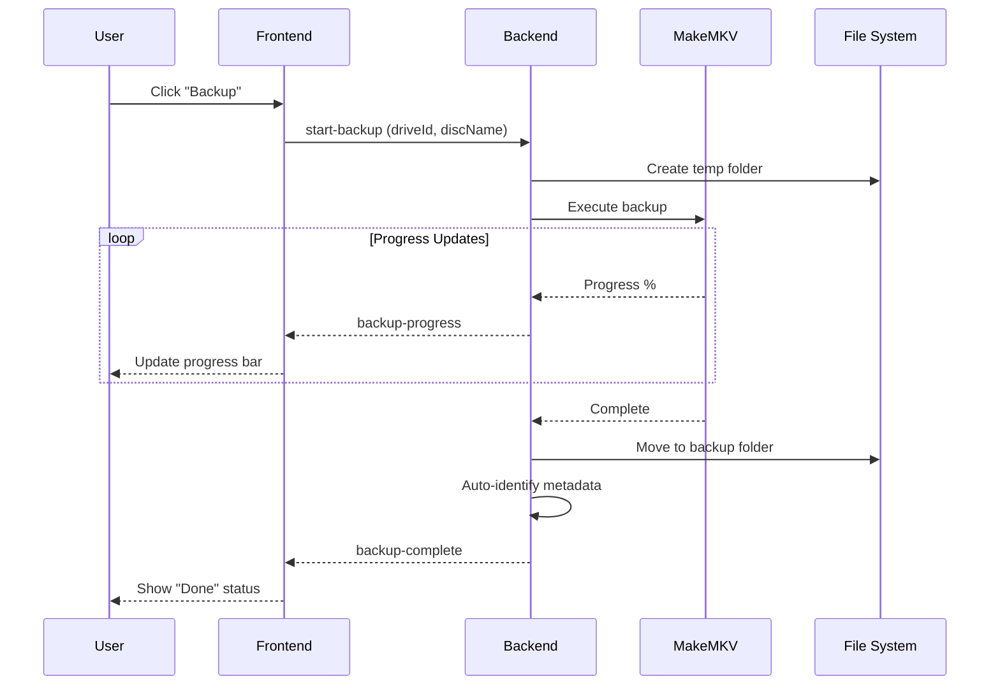
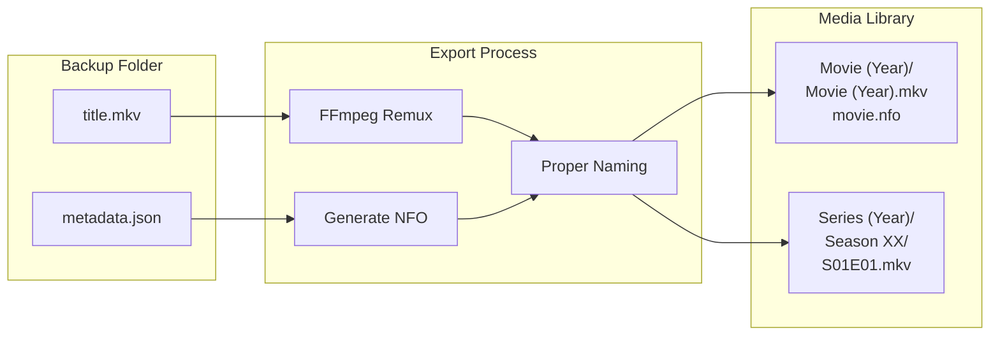
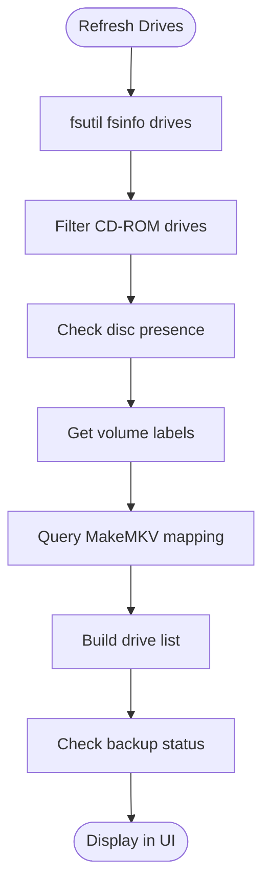

# EasyRip

A simple, portable Windows GUI for automated disc backup using MakeMKV.


## Features

- **Fast Drive Detection** - Instant optical drive scanning using Windows APIs
- **Parallel Backups** - Backup multiple discs simultaneously across multiple drives
- **Smart Status Tracking** - Automatically detects existing/incomplete backups
- **Metadata Identification** - AI-powered disc identification using TMDB and optional local LLM (Ollama)
- **Media Library Export** - Export backups to Emby/Jellyfin with proper naming and NFO files
- **Multi-Protocol Transfer** - Local, UNC/SMB, SFTP, SCP, and FTP support
- **Automation Options** - Auto-backup, auto-metadata, auto-export, and auto-eject
- **Portable** - Single executable, no installation required

## Quick Start

### Requirements

- **Windows 10/11** (64-bit)
- **[MakeMKV](https://www.makemkv.com/)** installed (default path: `C:\Program Files (x86)\MakeMKV\`)
- Optical drive(s) with DVD or Blu-ray disc

### Running EasyRip

1. Download `EasyRip-x.x.x-portable.exe` from [Releases](https://github.com/BattleSheep85/EasyRip/releases)
2. Run the executable - no installation needed
3. Insert a disc and click **Refresh Drives**
4. Click **Backup** to start ripping

## Configuration

Click **Settings** in the top-right corner to configure:

### Basic Settings

| Setting | Description | Default |
|---------|-------------|---------|
| MakeMKV Path | Path to `makemkvcon64.exe` | Auto-detected |
| Base Output Path | Where backups are stored | `D:\EasyRip` |
| MakeMKV Beta Key | Registration key for MakeMKV | Click "Auto-Fetch" |
| TMDB API Key | For metadata lookup | Get free at [themoviedb.org](https://www.themoviedb.org/settings/api) |

### Transfer Settings

Configure how exports are transferred to your media server:

| Protocol | Use Case |
|----------|----------|
| **Local** | Copy to local folder or mapped drive |
| **UNC/SMB** | Windows network share (`\\server\share`) |
| **SFTP** | SSH File Transfer (Linux/NAS servers) |
| **SCP** | SSH Copy Protocol |
| **FTP** | Standard FTP with optional TLS |

### Library Paths

Set paths for your Emby/Jellyfin libraries:
- **Movie Library Path** - Where movies are exported (e.g., `D:\Media\Movies`)
- **TV Library Path** - Where TV shows are exported (e.g., `D:\Media\TV Shows`)

## Folder Structure

```
D:\EasyRip\                    # Base path (configurable)
├── temp\                      # Active backup location
│   └── DISC_NAME\            # Temporary during backup
└── backup\                    # Completed backups
    ├── MOVIE_TITLE\
    │   ├── title00.mkv
    │   ├── title01.mkv
    │   └── metadata.json     # Auto-generated metadata
    └── TV_SERIES\
        └── ...
```

## How It Works

### Architecture



### Backup Workflow



### Export Workflow



### Drive Detection Flow



## Automation Toggles

Located in the toolbar:

| Toggle | Description |
|--------|-------------|
| **Backup** | Auto-start backup when disc inserted |
| **Meta** | Auto-identify metadata for new backups |
| **Export** | Auto-export approved backups |
| **Eject** | Eject disc after successful backup |
| **Live Dangerously** | Skip all confirmations, auto-approve metadata |

## Status Indicators

| Status | Meaning |
|--------|---------|
| **Ready** | No backup exists, ready to start |
| **Running** | Backup in progress |
| **Queued** | Waiting for another backup to finish |
| **Done** | Complete backup exists |
| **Incomplete** | Partial backup detected |
| **Error** | Backup failed (hover for details) |

## Keyboard Shortcuts

The application is primarily mouse-driven, but modals can be closed with `Escape`.

## Development

### Prerequisites

- Node.js 18+
- npm

### Setup

```bash
# Clone repository
git clone https://github.com/BattleSheep85/EasyRip.git
cd EasyRip

# Install dependencies
npm install

# Run in development mode
npm run electron:dev

# Build portable executable
npm run dist
```

### Project Structure

```
EasyRip/
├── src/
│   ├── main/           # Electron main process
│   │   ├── index.js    # App entry, IPC handlers
│   │   ├── makemkv.js  # MakeMKV CLI wrapper
│   │   ├── drives.js   # Windows drive detection
│   │   ├── transfer.js # Multi-protocol transfers
│   │   ├── logger.js   # File logging
│   │   └── metadata/   # TMDB & Ollama integration
│   ├── renderer/       # React frontend
│   │   ├── App.jsx     # Main component
│   │   └── *.jsx       # UI components
│   └── shared/         # Shared utilities
├── build/              # Build resources
├── tests/              # Test files
└── package.json
```

### Build Output

```bash
npm run dist
# Creates: dist/EasyRip-0.1.0-portable.exe (~85MB)
```

## Troubleshooting

### MakeMKV not found
Ensure MakeMKV is installed at `C:\Program Files (x86)\MakeMKV\` or update the path in Settings.

### No drives detected
- Check that your optical drive is recognized by Windows
- Try running as Administrator
- View Logs for detailed error messages

### Backup stuck at 0%
- MakeMKV may be reading the disc structure
- Check Logs for any error messages
- Some copy-protected discs may take longer to analyze

### Metadata not identifying
1. Ensure TMDB API key is configured
2. For better results, install [Ollama](https://ollama.ai/) locally
3. Check that disc names are readable

## License

MIT License - see [LICENSE](LICENSE) for details.

## Acknowledgments

- [MakeMKV](https://www.makemkv.com/) - The core disc ripping engine
- [TMDB](https://www.themoviedb.org/) - Movie/TV metadata API
- [Electron](https://www.electronjs.org/) - Desktop app framework
- [Ollama](https://ollama.ai/) - Local LLM for disc identification
