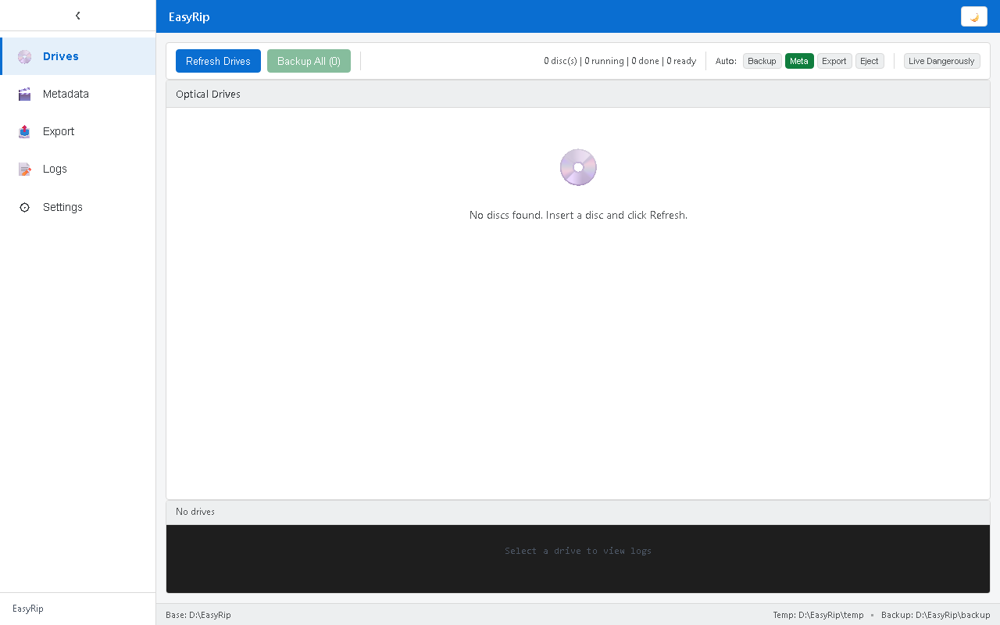
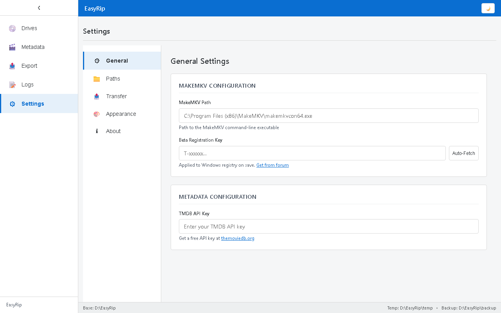
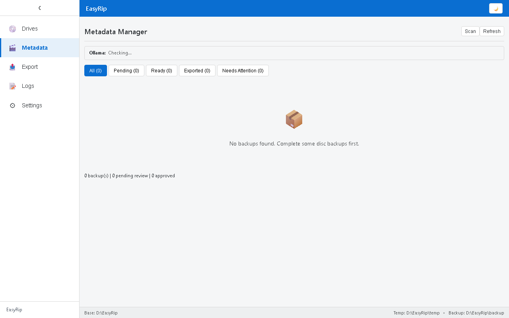
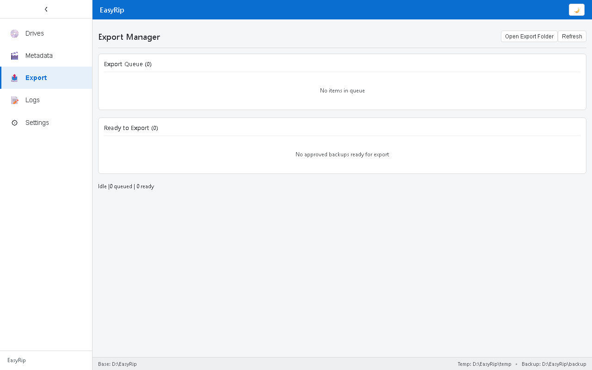
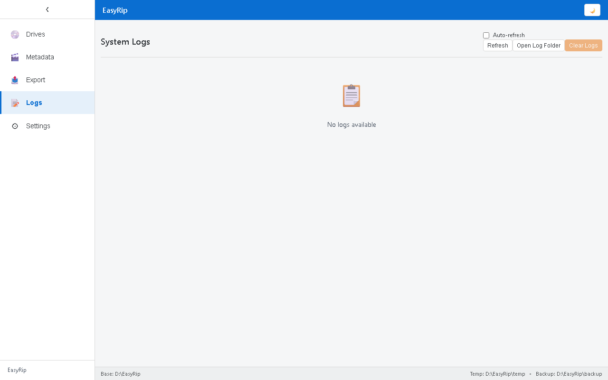
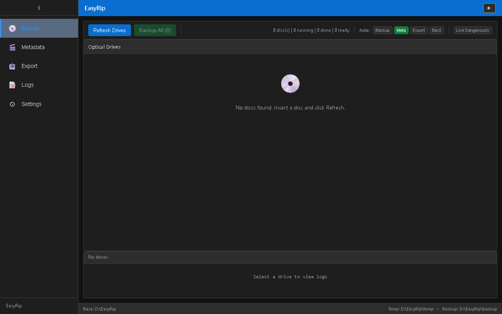

# EasyRip

<div align="center">


**Automated DVD & Blu-ray Backup Made Simple**

A modern Electron application for streamlined disc backup using MakeMKV, with AI-powered metadata management and flexible export options.

[](https://github.com/BattleSheep85/EasyRip/releases)
[](LICENSE)
[](https://github.com/BattleSheep85/EasyRip)
[](https://www.electronjs.org/)
[](https://reactjs.org/)

[Download](https://github.com/BattleSheep85/EasyRip/releases) • [Documentation](#documentation) • [Report Bug](https://github.com/BattleSheep85/EasyRip/issues) • [Request Feature](https://github.com/BattleSheep85/EasyRip/issues)

</div>

---

## Features

- **Automated Disc Detection** - Automatically detects optical drives and disc contents
- **Intelligent Backup Queue** - Queue multiple backups with sequential processing
- **AI-Powered Metadata** - Integrate with TMDB and Ollama for automatic disc identification and metadata enrichment
- **Flexible Export Options** - Transfer backups to local paths, network shares (UNC/SMB), SFTP, or FTP
- **Real-Time Progress Tracking** - Monitor backup and export progress with detailed status updates
- **Dark/Light Theme** - Comfortable viewing experience with theme toggle
- **Auto-Updates** - Built-in update checker keeps the app current
- **Comprehensive Logging** - Detailed logs for troubleshooting and audit trails
- **Modular Architecture** - Clean separation between main process and renderer for reliability

---

## Screenshots

### Home Page - Drive Detection & Backup


### Settings - Configuration


### Metadata Manager - AI-Powered Disc Identification


### Export Manager - Transfer Options


### Logs - Detailed Activity Tracking


### Dark Mode


---

## Installation

### Requirements

- **Operating System**: Windows 10/11 (64-bit)
- **MakeMKV**: [Download and install MakeMKV](https://www.makemkv.com/download/) (required for disc ripping)
- **Disk Space**: Sufficient storage for backups (Blu-ray discs can be 25-50GB+)

### Download & Install

1. Download the latest installer from the [Releases](https://github.com/BattleSheep85/EasyRip/releases) page
2. Run `EasyRip-Setup-x.x.x.exe`
3. Follow the installation wizard
4. Launch EasyRip from the Start Menu or Desktop shortcut

**Note**: The installer will prompt to install MakeMKV if not detected.

---

## Quick Start

### 5 Steps to Your First Backup

1. **Configure MakeMKV Path**
   - Open Settings (gear icon)
   - Navigate to **Paths** tab
   - Set the path to `makemkvcon64.exe` (usually `C:\Program Files (x86)\MakeMKV\makemkvcon64.exe`)

2. **Set Backup Location**
   - In Settings > **Paths** tab
   - Set your **Backup Output Path** (e.g., `D:\EasyRip\backup`)
   - Optionally set a **Temp Path** for in-progress backups

3. **Insert a Disc**
   - Insert a DVD or Blu-ray disc into your optical drive
   - EasyRip will automatically detect the disc

4. **Start Backup**
   - Click **Scan Drive** to analyze disc contents
   - Select the titles you want to backup (typically the main feature)
   - Click **Start Backup**

5. **Monitor Progress**
   - Watch real-time progress in the progress bar
   - View detailed logs by clicking the **Logs** button

---

## Configuration

### General Settings

| Setting | Description | Default |
|---------|-------------|---------|
| **Auto-Scan** | Automatically scan drives on app startup | Enabled |
| **Auto-Backup** | Automatically start backup when disc is detected | Disabled |
| **Notifications** | Show system notifications for backup events | Enabled |

### Path Settings

| Path | Purpose | Example |
|------|---------|---------|
| **MakeMKV Executable** | Location of `makemkvcon64.exe` | `C:\Program Files (x86)\MakeMKV\makemkvcon64.exe` |
| **Backup Output Path** | Where completed backups are stored | `D:\EasyRip\backup` |
| **Temp Path** | Temporary location during backup | `D:\EasyRip\temp` |

### Transfer Settings

Configure automatic or manual export of completed backups:

- **Local Path** - Copy to another drive or folder
- **UNC/SMB Path** - Transfer to network shares (e.g., `\\NAS\Media`)
- **SFTP** - Secure FTP transfer to remote servers
- **FTP** - Standard FTP transfer

### Appearance Settings

- **Theme** - Light, Dark, or System (auto-detect)
- **Compact Mode** - Reduce UI spacing for smaller screens

---

## Usage Guide

### Backing Up Discs

#### Manual Backup
1. Insert disc into optical drive
2. Click **Scan Drive** button
3. Review detected titles (sorted by size)
4. Select main title (usually the largest file)
5. Click **Start Backup**
6. Wait for completion (progress bar shows status)

#### Automatic Backup
Enable **Auto-Backup** in Settings to automatically start backup when a disc is inserted.

### Metadata Management

EasyRip can automatically identify discs and enrich metadata using TMDB and Ollama.

#### Setup
1. Navigate to **Metadata Manager** page
2. Configure **TMDB API Key** (get one free at [TMDB](https://www.themoviedb.org/settings/api))
3. Optionally configure **Ollama** for local AI inference

#### Workflow
1. After backup completes, go to Metadata Manager
2. Click **Identify Disc** on a backup
3. EasyRip uses AI to determine if disc is a movie or TV series
4. Review and edit metadata as needed
5. Metadata is saved with the backup

### Export Management

Transfer completed backups to external storage or network locations.

#### Manual Export
1. Navigate to **Export Manager** page
2. Select a backup from the list
3. Choose export destination (local, network, SFTP, FTP)
4. Click **Export**
5. Monitor progress in the status bar

#### Automatic Export
Enable **Auto-Export** in Transfer Settings to automatically transfer backups after completion.

---

## Automation

EasyRip offers three automation toggles for a hands-free workflow:

| Toggle | Function | Use Case |
|--------|----------|----------|
| **Auto-Scan** | Automatically scan drives on startup | Skip manual "Scan Drive" clicks |
| **Auto-Backup** | Start backup immediately when disc detected | Insert disc and walk away |
| **Auto-Export** | Transfer backup to configured destination after completion | Automatic network storage |

**Full Automation Workflow**:
1. Enable all three toggles in Settings
2. Configure export destination (e.g., network share)
3. Insert disc
4. EasyRip scans → backs up → exports → done!

---

## Transfer Options

### Local Path
Copy backups to another local drive or folder.

```
Example: E:\Media\Movies
```

### UNC/SMB Network Share
Transfer to Windows network shares or NAS devices.

```
Example: \\192.168.1.100\Media\Movies
Example: \\NAS-SERVER\Share\Backups
```

**Requirements**:
- Network share must be accessible from the Windows machine
- May require credentials (saved in Windows Credential Manager)

### SFTP (SSH File Transfer Protocol)
Secure transfer to remote Linux/Unix servers.

```
Host: sftp.example.com
Port: 22
Username: user
Password/Key: ********
Remote Path: /home/user/media/movies
```

**Requirements**:
- SSH access to remote server
- SFTP enabled on server

### FTP (File Transfer Protocol)
Standard FTP transfer to remote servers.

```
Host: ftp.example.com
Port: 21
Username: user
Password: ********
Remote Path: /public_html/media
```

---

## Troubleshooting

### Common Issues

#### Disc Not Detected
- **Solution**: Ensure disc is properly inserted and drive door is closed
- Check **Logs** for hardware errors
- Try clicking **Scan Drive** manually

#### MakeMKV Errors
- **Solution**: Verify MakeMKV is installed and licensed
- Check MakeMKV path in Settings > Paths
- Ensure disc is not copy-protected or damaged

#### Backup Stuck at 0%
- **Solution**: MakeMKV may be analyzing the disc structure (can take 1-2 minutes)
- Check temp path has sufficient disk space
- Review logs for errors

#### Export Fails
- **Solution**: Verify network connectivity for remote transfers
- Check credentials for SFTP/FTP
- Ensure destination has sufficient disk space

#### App Won't Start
- **Solution**: Check for corrupt settings file at `~/.easyrip-settings.json`
- Delete settings file to reset to defaults
- Reinstall the application

### Log Files

EasyRip maintains detailed logs for troubleshooting:

- **Location**: `~/.easyrip/logs/`
- **Format**: `easyrip-YYYY-MM-DD.log`
- **Access**: Click **Logs** button in the app or navigate to folder manually

---

## Development

### Building from Source

#### Prerequisites
- Node.js 18+ and npm
- Git

#### Steps

```bash
# Clone the repository
git clone https://github.com/BattleSheep85/EasyRip.git
cd EasyRip

# Install dependencies
npm install

# Run in development mode
npm run electron:dev

# Build for production
npm run dist
```

### Project Structure

```
EasyRip/
├── src/
│   ├── main/              # Electron main process (Node.js)
│   │   ├── index.js       # App entry, IPC handlers
│   │   ├── makemkv.js     # MakeMKV CLI adapter
│   │   ├── drives.js      # Drive detection
│   │   └── logger.js      # Logging system
│   ├── renderer/          # React frontend
│   │   ├── pages/         # Page components
│   │   ├── components/    # Reusable components
│   │   └── context/       # React context providers
│   └── styles/
│       └── app.css        # Application styles
├── tests/                 # Unit and E2E tests
├── build/                 # Build resources (icons, installer scripts)
└── docs/                  # Documentation and screenshots
```

### Tech Stack

- **Frontend**: React 18, React Router 7
- **Backend**: Electron 28, Node.js
- **Build Tool**: Vite 5
- **Testing**: Playwright, Node.js test runner
- **Packaging**: electron-builder

### Testing

```bash
# Run unit tests
npm test

# Run GUI tests (E2E)
npm run test:e2e

# Run in debug mode with Playwright inspector
npm run test:gui:debug
```

### Scripts

| Command | Description |
|---------|-------------|
| `npm run dev` | Start Vite dev server |
| `npm run electron:dev` | Start app in development mode |
| `npm run build` | Build renderer for production |
| `npm run dist` | Build installer for Windows |
| `npm test` | Run all unit tests |
| `npm run test:e2e` | Run end-to-end GUI tests |

---

## Contributing

Contributions are welcome! Please follow these guidelines:

1. **Fork the repository**
2. **Create a feature branch**: `git checkout -b feature/amazing-feature`
3. **Commit your changes**: `git commit -m 'Add amazing feature'`
4. **Push to the branch**: `git push origin feature/amazing-feature`
5. **Open a Pull Request**

### Contribution Guidelines

- Follow the existing code style (ES modules, async/await)
- Write tests for new features
- Update documentation as needed
- Keep commits focused and descriptive

---

## Credits

EasyRip is built on top of excellent open-source projects and services:

- **[MakeMKV](https://www.makemkv.com/)** - DVD and Blu-ray decryption and transcoding
- **[TMDB (The Movie Database)](https://www.themoviedb.org/)** - Movie and TV show metadata
- **[Ollama](https://ollama.ai/)** - Local AI inference for disc identification
- **[Electron](https://www.electronjs.org/)** - Cross-platform desktop framework
- **[React](https://reactjs.org/)** - UI library
- **[Vite](https://vitejs.dev/)** - Build tool and dev server

Special thanks to all contributors and users who help make EasyRip better!

---

## License

This project is licensed under the MIT License - see the [LICENSE](LICENSE) file for details.

---

## Support

- **Issues**: [GitHub Issues](https://github.com/BattleSheep85/EasyRip/issues)
- **Discussions**: [GitHub Discussions](https://github.com/BattleSheep85/EasyRip/discussions)

---

<div align="center">

**Made with ❤️ for the home media preservation community**

[⬆ Back to Top](#easyrip)

</div>
